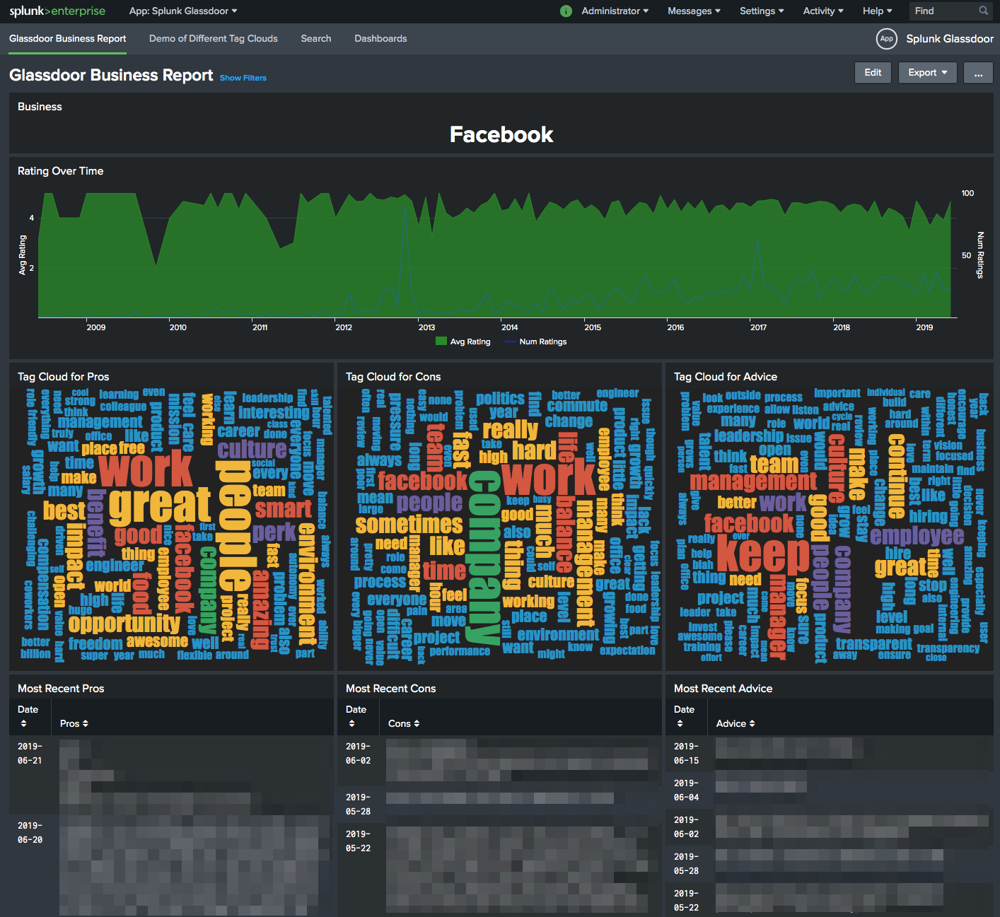
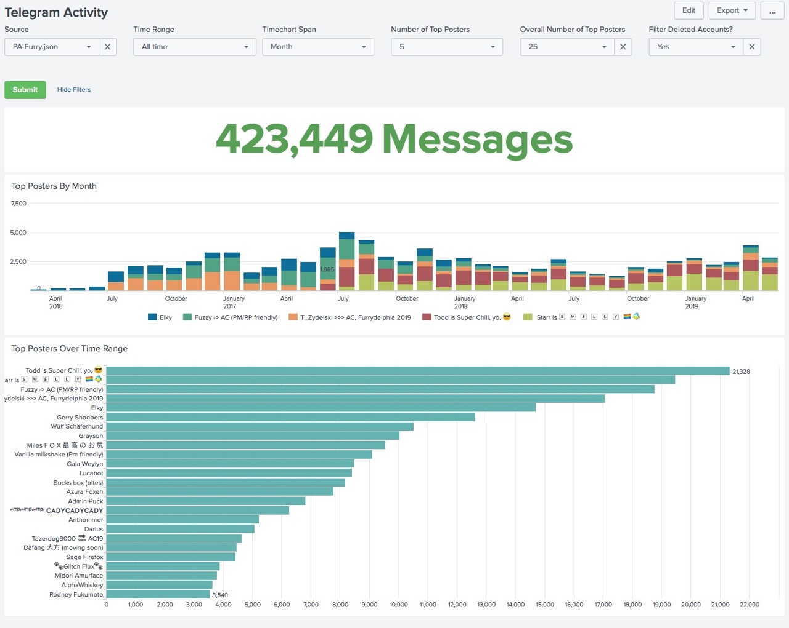
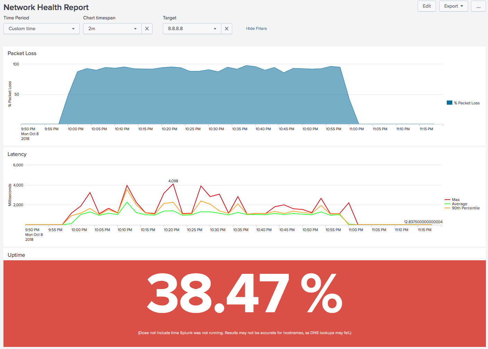
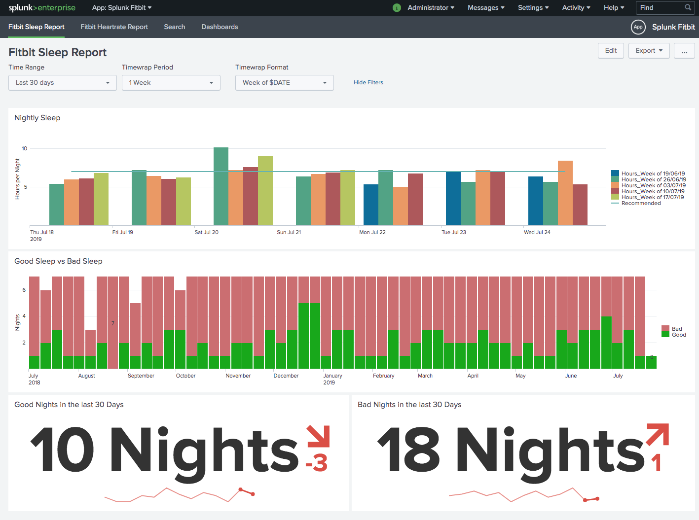
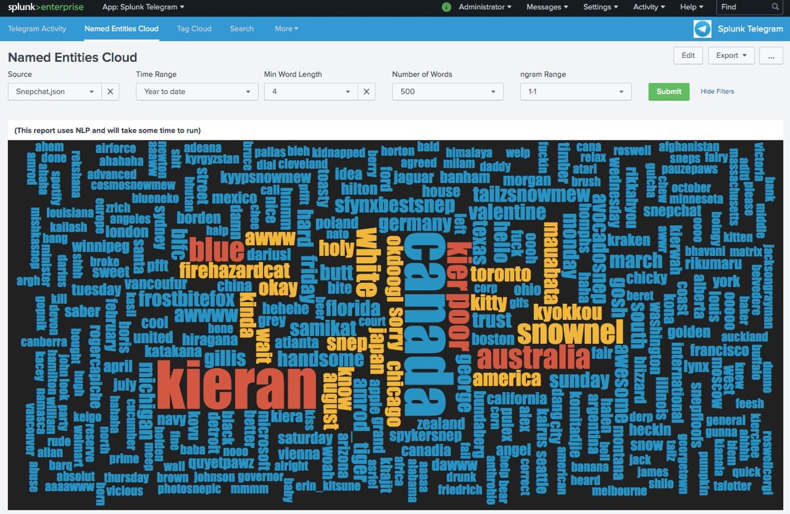
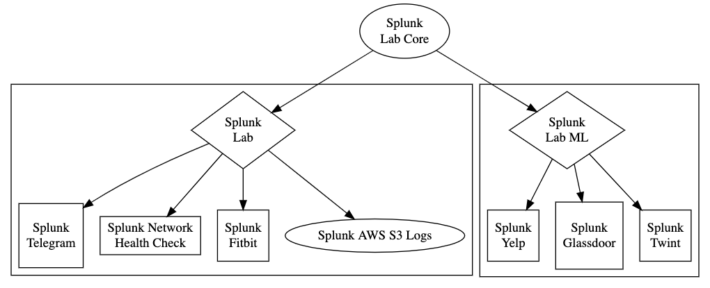

# Splunk Lab

This project lets you stand up a Splunk instance in Docker on a quick and dirty basis.

But what is Splunk?  <a href="https://www.splunk.com/">Splunk</a> is a platform for big data collection and analytics.  You feed your events from syslog, webserver logs, or application logs into Splunk, and can use queries to extract meaningful insights from that data.


## Quick Start!

Paste either of these on the command line:

`bash <(curl -s https://raw.githubusercontent.com/dmuth/splunk-lab/master/go.sh)`

`bash <(curl -Ls https://bit.ly/splunklab)`

...and the script will print up what directory it will ingest logs from, your password, etc.  Follow the on-screen
instructions for setting environment variables and you'll be up and running in no time!  Whatever logs you had sitting in your `logs/` directory will be searchable in Splunk with the search `index=main`.

If you want to see neat things you can do in Splunk Lab, check out <a href="#cookbook">the Cookbook section</a>.

Also, the script will craete a directory called `bin/` with some helper scripts in it.  Be sure to check them out!


### Useful links after starting

- [https://localhost:8000/](https://localhost:8000/) - Default port to log into the local instance.  Username is `admin`, password is what was set when starting Splunk Lab.
- [Splunk Dashboard Examples](https://localhost:8000/en-US/app/simple_xml_examples/contents) - Wanna see what you can do with Splunk?  Here are some example dashboards.


## Features

- App databoards can be stored in the local filesystem (they don't dissappear when the container exits)
- Ingested data can be stored in the local filesystem
- Multiple REST and RSS endpoints "built in" to provide sources of data ingestion 
- Integration with <a href="https://www.baboonbones.com/#activation">REST API Modular Input</a>
- Splunk Machine Learning Toolkit included
- `/etc/hosts` can be appended to with local ip/hostname entries
- Ships with Eventgen to populate your index with fake webserver events for testing.


## Screenshots

These are screenshots with actual data from production apps which I built on top of Splunk Lab:

<a href="img/bella-italia.png">
</a>
<a href="img/facebook-glassdoor.png">
</a>
<a href="img/pa-furry-stats.jpg">
</a>
<a href="img/network-huge-outage.png">
</a>
<a href="img/fitbit-sleep-dashboard.png">
</a>
<a href="img/snepchat-tag-cloud.jpg">
</a>


<a name="cookbook"></a>
## Splunk Lab Cookbook

What can you do with Splunk Lab?  Here are a few examples of ways you can use Splunk Lab:

### Ingest some logs for viewing, searching, and analysis

- Drop your logs into the `logs/` directory.
- `bash <(curl -Ls https://bit.ly/splunklab)`
- Go to https://localhost:8000/
- Ingsted data will be written to `data/` which will persist between runs.

### Ingest some logs for viewing, searching, and analysis but DON'T keep ingested data between runs

- `SPLUNK_DATA=no bash <(curl -Ls https://bit.ly/splunklab)`
- Note that `data/` will not be written to and launching a new container will cause `logs/` to be indexed again.
   - This will increase ingestion rate on Docker for OS/X, as there are some issues with the filesystem driver in OS/X Docker.

### Play around with synthetic webserver data

- `SPLUNK_EVENTGEN=1 bash <(curl -Ls https://bit.ly/splunklab)`
- Fake webserver logs will be written every 10 seconds and can be viewed with the query `index=main sourcetype=nginx`.  The logs are based on actual HTTP requests which have come into the <a href="https://www.dmuth.org/">webserver hosting my blog</a>.
 
### Adding Hostnames into /etc/hosts

- Edit a local hosts file
- `ETC_HOSTS=./hosts bash <(curl -Ls https://bit.ly/splunklab)`
- This can be used in conjunction with something like <a href="https://github.com/dmuth/splunk-network-health-check">Splunk Network Monitor</a> to ping hosts that don't have DNS names, such as your home's webcam. :-)

### Get the Docker command line for any of the above

- Run any of the above with `PRINT_DOCKER_CMD=1` set, and the Docker command line that's used will be written to stdout.

### Run Splunk Lab in Development Mode with a bash Shell

This would normally be done with the script `./bin/devel.sh` when running from the repo, 
but if you're running Splunk Lab just with the Docker image, here's how to do it:

`docker run -p 8000:8000 -e SPLUNK_PASSWORD=password1 -v $(pwd)/data:/data -v $(pwd)/logs:/logs --name splunk-lab --rm -it -v $(pwd):/mnt -e SPLUNK_DEVEL=1 dmuth1/splunk-lab bash`

This is useful mainly if you want to poke around in Splunk Lab while it's running.  Note that you 
could always just run `docker exec splunk-lab bash` instead of doing all of the above. :-)


## Splunk Apps Included

The following Splunk apps are included in this Docker image:

- <a href="https://splunkbase.splunk.com/app/1924">Eventgen</a>
- <a href="https://splunkbase.splunk.com/app/1603/">Splunk Dashboard Examples</a>
<!--
- <a href="https://splunkbase.splunk.com/app/2646/">Syndication Input</a>
-->
- <a href="https://splunkbase.splunk.com/app/1546/">REST API Modular Input</a> (requires registration)
- <a href="https://splunkbase.splunk.com/app/3212/">Wordcloud Custom Visualization</a>
- <a href="https://splunkbase.splunk.com/app/2878/">Slack Notification Alert</a>
- <a href="https://splunkbase.splunk.com/app/2890/">Splunk Machine Learning Toolkit</a>
   - <a href="https://splunkbase.splunk.com/app/2882/">Python for Scientific Computing (for Linux 64-bit)</a>
   - <a href="https://splunkbase.splunk.com/app/4066/">NLP Text Analytics</a>
   - <a href="https://splunkbase.splunk.com/app/3514/">Halo - Custom Visualization</a>
   - <a href="https://splunkbase.splunk.com/app/3112/">Sankey Diagram - Custom Visualization</a>


All apps are covered under their own license.  Please check <a href="vendor/README.md">the Apps page</a>
for more info.

Splunk has its own license.  Please abide by it.


## Free Sources of Data

I put together this curated list of free sources of data which can be pulled into Splunk
via one of the included apps:

- RSS
   - <a href="https://answers.splunk.com/feed/questions.rss">Recent questions posted to Splunk Answers</a>
   - <a href="http://www.cnn.com/services/rss/">CNN RSS feeds</a>
   - <a href="https://www.flickr.com/services/feeds/docs/photos_public/">Flickr's Public feed</a>
      - <a href="https://api.flickr.com/services/feeds/photos_public.gne">Public Photos</a>
      - <a href="https://api.flickr.com/services/feeds/photos_public.gne?tags=cheetah">Public photos tagged "cheetah"</a>
- REST (you will need to set `$REST_KEY` when starting Splunk Lab)
   - Non-streaming
      - <a href="http://www3.septa.org/hackathon/">Philadelphia Public Transit API</a>
         - <a href="http://www3.septa.org/hackathon/TrainView/">Regional Rail Train Data</a>
      - <a href="https://developers.coinbase.com/docs/wallet/guides/price-data">Coinbase API</a>
      - <a href="https://www.weather.gov/documentation/services-web-api">National Weather Service</a>
      - <a href="https://api.weather.gov/gridpoints/PHI/49,75/forecast">Philadelphia Forecast</a>
      - <a href="https://api.weather.gov/gridpoints/PHI/49,75/forecast/hourly">Philadelphia Hourly Forecast</a>
      - <a href="https://www.alphavantage.co/">Alpha Vantage</a> - Free stock quotes
   - Streaming
      - <a href="https://www.meetup.com/meetup_api/docs/stream/2/rsvps/">Meetup RSVPs</a>
      - <a href="http://stream.meetup.com/2/rsvps">RSVP Endpoint</a>


## Apps Built With Splunk Lab

Since building Splunk Lab, I have used it as the basis for building other projects:

- <a href="https://github.com/dmuth/SeptaStats/tree/master">SEPTA Stats</a>
   - Website with real-time stats on <a href="http://www.septa.org/service/rail/">Philadelphia Regional Rail</a>.
   - Pulled down over 60 million train data points over 4 years using Splunk.
- <a href="https://github.com/twintproject/twint-splunk">Splunk Twint</a>
   - Splunk dashboards for Twitter timelines downloaded by Twint.  This now a part of the <a href="https://github.com/twintproject">TWINT Project</a>.
- <a href="https://github.com/dmuth/splunk-yelp-reviews">Splunk Yelp Reviews</a>
   - This project lets you pull down Yelp reviews for venues and view visualizations and wordclouds of positive/negative reviews in a Splunk dashboard.
- <a href="https://github.com/dmuth/splunk-glassdoor">Splunk Glassdoor Reviews</a>
   - Similar to Splunk Yelp, this project lets you pull down company reviews from Glassdoor and Splunk them
- <a href="https://github.com/dmuth/splunk-telegram">Splunk Telegram</a>
   - This app lets you run Splunk against messages from Telegram groups and generate graphs and word clouds based on the activity in them.
- <a href="https://github.com/dmuth/splunk-network-health-check">Splunk Network Health Check</a>
   - Pings 1 or more hosts and graphs the results in Splunk so you can monitor network connectivity over time.
- <a href="https://github.com/dmuth/splunk-fitbit">Splunk Fitbit</a>
   - Analyzes data from your Fitbit
- <a href="https://github.com/dmuth/splunk-aws-s3-server-accesslogs">Splunk for AWS S3 Server Access Logs</a>
   - App to analyize AWS S3 Access Logs


Here's all of the above, presented as a graph:




## Building Your Own Apps Based on Splunk Lab

A sample app (and instructions on how to use it) are in the 
<a href="sample-app/">sample-app directory</a>.  
Feel free to expand on that app for your own apps.


## A Word About Security

HTTPS is turned on by default.  Passwords such as `password` and <a href="https://www.youtube.com/watch?v=a6iW-8xPw3k">12345</a> are not permitted.

Please, for the love of god, <a href="https://diceware.dmuth.org/">use a strong password</a> if you are deploying
this on a public-facing machine.


## FAQ

### How do I get a valid SSL cert on localhost?

Yes, you can! 

First, install <a href="https://github.com/FiloSottile/mkcert">mkcert</a> and then run `mkcert -install && mkcert localhost 127.0.0.1 ::1` to generate a local CA and a cert/key combo for localhost.

Then, when you run Splunk Lab, set the environment variables `SSL_KEY` and `SSL_CERT` and those files will be pulled into Splunk Lab.

Example: `SSL_KEY=./localhost.key SSL_CERT=./localhost.pem ./go.sh`


### How do I get this to work in Vagrant?

TL;DR If you're on a Mac, use <a href="https://orbstack.dev/">OrbStack</a>.

If you're running <a href="https://github.com/dmuth/docker-in-vagrant">Docker in Vagrant</a>, or just plain Vagrant, you'll run into issues because Splunk does some low-level stuff with its Vagrant directory that will result in errors in `splunkd.log` that look like this:

```
11-15-2022 01:45:31.042 +0000 ERROR StreamGroup [217 IndexerTPoolWorker-0] - failed to drain remainder total_sz=24 bytes_freed=7977 avg_bytes_per_iv=332 sth=0x7fb586dfdba0: [1668476729, /opt/splunk/var/lib/splunk/_internaldb/db/hot_v1_1, 0x7fb587f7e840] reason=st_sync failed rc=-6 warm_rc=[-35,1]
```

To work around this, disable sharing of Splunk's data directory by setting `SPLUNK_DATA=no`, like this:

`SPLUNK_DATA=no SPLUNK_EVENTGEN=yes ./go.sh`

By doing this, any data ingested into Spunk will not persist between runs.  But to be fair, Splunk Lab is meant for development usage of Splunk, not long-term usage.


### Does this work on Macs?

Sure does!  I built this on a Mac. :-)

For best results, run under <a href="https://orbstack.dev/">OrbStack</a>.


## Development

I wrote a series of helper scripts in `bin/` to make the process easier:

- `./bin/download.sh` - Download tarballs of various apps and splits some of them into chunks
  - If downloading a new version of Splunk, edit `bin/lib.sh` and bump the `SPLUNK_VERSION` and `SPLUNK_BUILD` variables.
- `./bin/build.sh [ --force ]` - Build the containers.
   - Note that this downloads packages from an AWS S3 bucket that I created.  This bucket is set to "requestor pays", so you'll need to make sure the `aws` CLI app set up.
   - If you are (re)building Splunk Lab, you'll want to use `--force`.
- `./bin/upload-file-to-s3.sh` - Upload a specific file to S3.  For rolling out new versions of apps
- `./bin/push.sh` - Tag and push the container.
- `./bin/devel.sh` - Build and tag the container, then start it with an interactive bash shell.
   - This is a wrapper for the above-mentioned `go.sh` script. Any environment variables that work there will work here.
   - **To force rebuilding a container during development** touch the associated Dockerfile in `docker/`.  E.g. `touch docker/1-splunk-lab` to rebuild the contents of that container.
- `./bin/create-1-million-events.py` - Create 1 million events in the file `1-million-events.txt` in the current directory.
   - If not in `logs/` but reachable from the Docker container, the file can then be oneshotted into Splunk with the following command: `/opt/splunk/bin/splunk add oneshot ./1-million-events.txt -index main -sourcetype oneshot-0001`
- `./bin/kill.sh` - Kill a running `splunk-lab` container.
- `./bin/attach.sh` - Attach to a running `splunk-lab` container.
- `./bin/clean.sh` - Remove `logs/` and/or `data/` directories.
- `./bin/tarsplit` - Local copy of my pacakge from https://github.com/dmuth/tarsplit


### Building a New Version of Splunk

- Bump version number and build number in `bin/download.sh`
- Bump version number and build number in `bin/build.sh`
- Bump version number and build number in `docker/0-1-splunk`


### Building Container Internals

- Here's the layout of the `cache/` directory
   - `cache/` - Where tarballs for Splunk and its apps hang out.  These are downloaded when `bin/download.sh` is run for the first time.
   - `cache/deploy/` - When creating a specific Docker image, files are copied here so the Dockerfile can ingest them.  (Or rather hardlinked to the files in the parent directory.)
   - `cache/build/` - 0-byte files are written here when a specific container is built, and on future builds, the age of that file is checked against the Dockerfile.  If the Dockerfile is newer, then the container is (re-)built.  Otherwise, it is skipped.  This shortens a run of `bin/devel.sh` where no containers need to be built from 12 seconds on my 2020 iMac to 0.2 seconds.


### A word on default/ and local/ directories

I had to struggle with this for awhile, so I'm mostly documenting it here.

When in devel mode, `/opt/splunk/etc/apps/splunk-lab/` is mounted to `./splunk-lab-app/` via `go.sh`
and the entrypoint script inside of the container symlinks `local/` to `default/`.
This way, any changes that are made to dashboards will be propagated outside of
the container and can be checked in to Git.

When in production mode (e.g. running `./go.sh` directly), no symlink is created,
instead `local/` is mounted by whatever `$SPLUNK_APP` is pointing to (default is `app/`), so that any
changes made by the user will show up on their host, with Splunk Lab's `default/`
directory being untouched.


## Additional Reading

- <a href="https://github.com/dmuth/splunk-network-health-check">Splunk Network Health Check</a>


## Notes/Bugs

- The Docker containers are **dmuth1/splunk-lab** and **dmuth1/splunk-lab-ml**.  The latter has all of the Machine Learning apps built in to the image.  Feel free to extend those for your own projects.
- If I run `./bin/create-test-logfiles.sh 10000` and then start Splunk Lab on a Mac, all of the files will be Indexed without any major issues, but then the CPU will spin, and not from Splunk. 
   - The root cause is that the filesystem code for Docker volume mappings on OS/X's Docker implementation is VERY inefficient in terms of both CPU and memory usage, especially when there are 10,000 files involved.  The overhead is just crazy.  When reading events from a directory mounted through Docker, I see about 100 events/sec.  When the directory is local to the container, I see about 1,000 events/sec, for a 10x difference.
- The HTTPS cert is self-signed with Splunk's own CA.  If you're tired of seeing a Certificate Error every time you try connecting to Splunk, you can follow the instructions at https://stackoverflow.com/a/31900210/196073 to allow self-signed certificates for `localhost` in Google Chrome.
   - Please understand the implications before you do this.


## Credits

- <a href="https://github.com/mhassan2/splunk-n-box">Splunk N' Box</a> - Splunk N' Box is used to create entire Splunk clusters in Docker.  It was the first actual use of Splunk I saw in Docker, and gave me the idea that hey, maybe I could run a stand-alone Splunk instance in Docker for ad-hoc data analysis!
- <a href="http://www.splunk.com/">Splunk</a>, for having such a fantastic product which is also a great example of Operational Excellence!
- <a href="https://splunkbase.splunk.com/app/1924">Eventgen</a> is a super cool way of generating simulating real data that can be used to generate dashboards for testing and training purposes.
- <a href="http://patorjk.com/software/taag/#p=display&h=0&v=0&f=Standard&t=Splunk%20Lab">This text to ASCII art generator</a>, for the logo I used in the script.
- The logo was made over at <a href="https://www.freelogodesign.org/">https://www.freelogodesign.org/</a>
- <a href="https://liw.fi/readme-review/">Lars Wirzenius</a> for a review of this README.


## Copyrights

- Splunk is copyright by Splunk, Inc.  Please stay within the confines of the 500 MB/day free license when using Splunk Lab, unless you brought your own license along.
- The various apps are copyright by the creators of those apps.


## Contact

My email is doug.muth@gmail.com.  I am also <a href="http://twitter.com/dmuth">@dmuth on Twitter</a> 
and <a href="http://facebook.com/dmuth">Facebook</a>!


