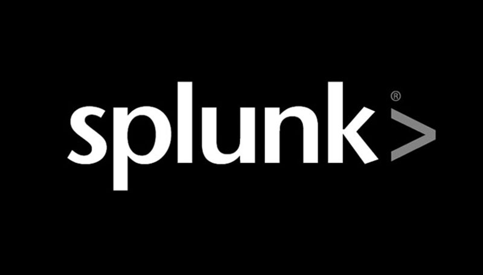
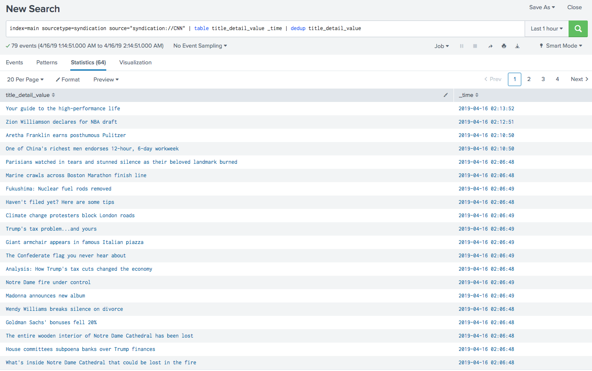

# Splunk Lab

This project lets you stand up a Splunk instance in Docker on a quick and dirty basis.
It is based on <a href="https://hub.docker.com/r/splunk/splunk/">Splunk's official Dockerfile</a>

## Quick Start!

Paste this in on the command line:

`SPLUNK_START_ARGS=--accept-license bash <(curl -s https://raw.githubusercontent.com/dmuth/splunk-lab/master/go.sh)`

...and the script will print up what directory it will ingest logs from, etc.  Follow the on-screen
instructions for setting environment variables and you'll be up and running in no time!

## Apps Built With Splunk Lab

Since building Splunk Lab, I have used it as the basis for building other projects:

- <a href="https://github.com/dmuth/splunk-yelp-reviews">Splunk Yelp Reviews</a>
   - This project lets you pull down Yelp reviews for venues and view the results in a Splunk dashboard
- <a href="https://github.com/dmuth/splunk-network-health-check">Splunk Network Health Check</a>
   - Pings 1 or more hosts and graphs the results in Splunk so you can monitor network connectivity over time

## Screenshots

  

## Splunk Apps Included

The following Splunk apps are included in this Docker image:

- <a href="https://splunkbase.splunk.com/app/2646/">Syndication Input</a>
- <a href="https://splunkbase.splunk.com/app/1546/">REST API Modular Input</a> (requires registration)
- <a href="https://splunkbase.splunk.com/app/3212/">Wordcloud Custom Visualization</a>
- <a href="https://splunkbase.splunk.com/app/2878/">Slack Notification Alert</a>
- <a href="https://splunkbase.splunk.com/app/2890/">Splunk Machine Learning Toolkit</a>

All apps are covered under their own license.  Please check <a href="vendor/README.md">the Apps page</a>
for more info.

Splunk has its own license.  Please abide by it.

## Free Sources of Data

I put together this curated list of free sources of data which can be pulled into Splunk
via one of the includes apps:

- Free
    - RSS
       - <a href="https://answers.splunk.com/feed/questions.rss">Recent questions posted to Splunk Answers</a>
       - <a href="http://www.cnn.com/services/rss/">CNN RSS feeds</a>
       - <a href="https://www.flickr.com/services/feeds/docs/photos_public/">Flickr's Public feed</a>
          - <a href="https://api.flickr.com/services/feeds/photos_public.gne">Public Photos</a>
          - <a href="https://api.flickr.com/services/feeds/photos_public.gne?tags=cheetah">Public photos tagged "cheetah"</a>
    - Non-RSS
       - Non-streaming
          - <a href="http://www3.septa.org/hackathon/">Philadelphia Public Transit API</a>
             - <a href="http://www3.septa.org/hackathon/TrainView/">Regional Rail Train Data</a>
          - <a href="https://developers.coinbase.com/docs/wallet/guides/price-data">Coinbase API</a>
         - <a href="https://www.weather.gov/documentation/services-web-api">National Weather Service</a>
            - <a href="https://api.weather.gov/gridpoints/PHI/49,75/forecast">Philadelphia Forecast</a>
            - <a href="https://api.weather.gov/gridpoints/PHI/49,75/forecast/hourly">Philadelphia Hourly Forecast</a>
         - <a href="https://www.alphavantage.co/">Alpha Vantage</a> - Free stock quotes
       - Streaming
          - <a href="https://www.meetup.com/meetup_api/docs/stream/2/rsvps/">Meetup RSVPs</a>
             - <a href="http://stream.meetup.com/2/rsvps">RSVP Endpoint</a>

## Common Uses

**If you are having a system issue, and want to ingest your logs, persist the ingested data between Splunk runs, and persist 
created dashboards as well:**

`docker run -p 8000:8000 bash -e SPLUNK_PASSWORD=password -e SPLUNK_START_ARGS=--accept-license -v /var/log:/logs -v $(pwd)/data:/data -v $(pwd)/app:/app -d dmuth1/splunk-lab`

**If you want to do data analytics on files in the logs/ directory, and persist the ingested data between Splunk runs, and
persist created dashboards as well:**

`docker run -p 8000:8000 -e SPLUNK_PASSWORD=password -e SPLUNK_START_ARGS=--accept-license -v $(pwd)/logs:/logs -v $(pwd)/data:/data -v $(pwd)/app:/app -d dmuth1/splunk-lab`

Once Splunk is running, you can log in with the `admin` user and password you specified, 
and doing a query for `index=main` should show your logs.

BTW, your password will be sanity checked.  Don't use `password` as your password. ;-)

## A Word About Security

HTTPS is turned on by default.  Passwords such as `password` and <a href="https://www.youtube.com/watch?v=a6iW-8xPw3k">12345</a> are not permitted.

Please, <a href="https://diceware.dmuth.org/">use a strong password</a> if you are deploying
this on a public-facing machine.

## FAQ

### Does this work on Macs?

Sure does!  I built this on a Mac. :-)

## Development

I wrote a series of helper scripts in `bin/` to make the process easier:

- `./bin/build.sh` - Build the container.
- `./bin/push.sh` - Tag and push the container.
- `./bin/devel.sh` - Build and tag the container, then start it with an interactive bash shell.
   - This is a wrapper for the above-mentioned `go.sh` script. Any environment variables that work there will work here.
- `./bin/clean.sh` - Remove logs/ and/or data/ directories.

## Additional Reading

- <a href="https://github.com/dmuth/splunk-network-health-check">Splunk Network Health Check</a>

## Credits

- <a href="http://www.splunk.com/">Splunk</a>, for having such a kick-ass product!
- <a href="http://patorjk.com/software/taag/#p=display&h=0&v=0&f=Standard&t=Splunk%20Lab">This text to ASCII art generator</a>, for the logo I used in the script.

## Contact

My email is doug.muth@gmail.com.  I am also <a href="http://twitter.com/dmuth">@dmuth on Twitter</a> 
and <a href="http://facebook.com/dmuth">Facebook</a>!

